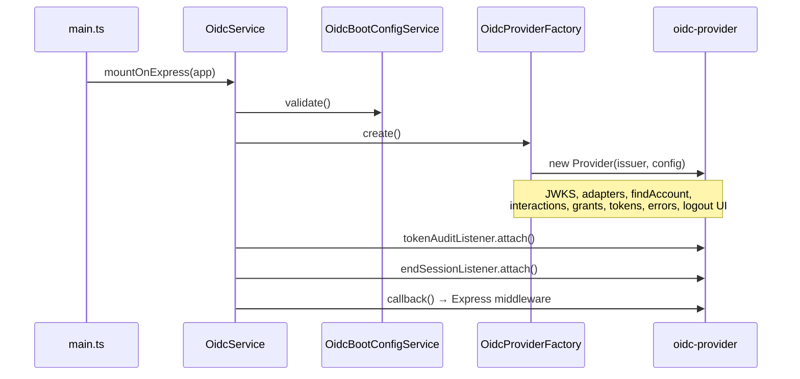
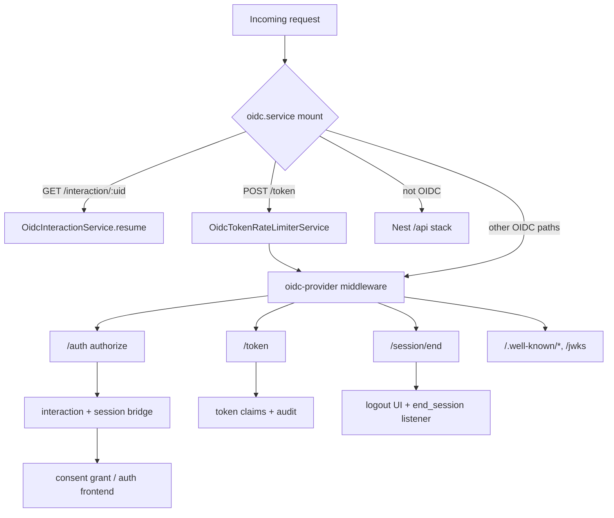

# OIDC code flow

How to read this module. For protocol behavior and env vars, see [README.md](./README.md). For strategy, see [ADR-001](../../../../docs/adr/ADR-001-oidc-provider-strategy.md).

## Start here

| Step | File | Role |
|------|------|------|
| 1 | `src/main.ts` | Excludes OIDC paths from `/api` prefix; calls `OidcService.mountOnExpress()` |
| 2 | `oidc.module.ts` | NestJS wiring — all providers and `OidcConsentController` |
| 3 | `oidc.service.ts` | Boot sequence, Express mount, `/interaction/:uid` handler, token rate limit |
| 4 | `provider/oidc-provider.factory.ts` | Builds `oidc-provider` instance and registers hooks |

Everything else is invoked **by the provider** (callbacks/listeners) or **by Nest** (consent API).

## Initialization (app startup)



## HTTP request routing

OIDC lives at the **issuer root** (not under `/api`). `provider/oidc-routes.constants.ts` defines paths and `isOidcHttpPath()`.



## Folder layout

Production code is grouped by OIDC lifecycle phase:

```
oidc/
  oidc.module.ts
  oidc.service.ts
  boot/
  client/
  provider/
  login/
  consent/
  token/
  logout/
```

## Logical groups

Files are grouped below by **when they run** in a flow.

### Boot and crypto

Runs once at startup before the provider accepts traffic.

| File | Role |
|------|------|
| `boot/oidc-boot.config.ts` | Fail-fast issuer / JWKS path validation |
| `boot/oidc-issuer.validation.ts` | Issuer URL rules (`OidcBootConfigError`) |
| `boot/oidc-jwks.service.ts` | Load RS256 PEM → signing JWKS; export public JWKS |

### Provider wiring

Constructs and configures `oidc-provider`.

| File | Role |
|------|------|
| `provider/oidc-provider.factory.ts` | Dynamic ESM import + `Provider` construction |
| `provider/oidc-provider.types.ts` | Event/context type guards |
| `provider/oidc-routes.constants.ts` | Protocol paths, global prefix exclusions, path helpers |
| `provider/oidc-adapter.factory.ts` | Client adapter + in-memory adapters for other models (dev) |
| `provider/oidc-client.adapter.ts` | `Client` storage adapter `find()` |

### Client resolution

Used whenever `client_id` is resolved (authorize, token, logout).

| File | Role |
|------|------|
| `client/oidc-client.registry.ts` | Read-through cache (60s TTL) |
| `client/oidc-client.mapper.ts` | `oauth_clients` row → oidc-provider Client payload |

Chain: `OidcClientAdapter.find()` → `OidcClientRegistry` → `OAuthClientRepository` → `mapOAuthClientToOidcPayload()`.

### Login and authorize (F23, F27)

| File | Role |
|------|------|
| `login/oidc-interaction.service.ts` | `/interaction/:uid` resume + login redirect |
| `login/oidc-interaction-request.util.ts` | Capture interaction response for redirects |
| `login/oidc-user-session.bridge.ts` | F16 cookie session → OIDC login |
| `login/oidc-account.service.ts` | `findAccount` + OIDC claims |
| `login/oidc-hosted-error.service.ts` | `renderError` → auth frontend `/oauth/error` |

Unauthenticated authorize → auth frontend login → cookies set → `resume()` completes interaction.

### Consent (F26)

| File | Role |
|------|------|
| `consent/oidc-consent-grant.service.ts` | `loadExistingGrant`, remembered consent, auto-consent for first-party |
| `consent/oidc-consent.controller.ts` | Nest API used by auth frontend consent UI |

Third-party clients → auth frontend `/consent`. `trusted_first_party` clients skip the prompt.

### Token (F24, F25)

| File | Role |
|------|------|
| `token/oidc-resource.config.ts` | Resource indicators → JWT access tokens (`aud`, RS256) |
| `token/oidc-token-claims.service.ts` | `extraTokenClaims` (`email`, `email_verified`) |
| `token/oidc-token-rate-limiter.service.ts` | Rate limit on `POST /token` (by client IP) |
| `token/oidc-token-audit.listener.ts` | `grant.success` → `oidc.token.issued` audit |

Authorization code + PKCE and refresh-token rotation are handled inside `oidc-provider`; we hook claims, rate limit, and audit.

### Logout (F28)

| File | Role |
|------|------|
| `logout/oidc-logout-ui.service.ts` | RP-initiated logout confirm UI (auto-submit form) |
| `logout/oidc-end-session.listener.ts` | `end_session.success` → revoke F16 session + clear cookies |

## Debugging guide

| Symptom | Read first |
|---------|------------|
| App won't start / OIDC init error | `boot/oidc-boot.config.ts`, `boot/oidc-jwks.service.ts` |
| 404 on `/.well-known` or `/auth` | `main.ts` exclusions, `oidc.service.ts` mount, `provider/oidc-routes.constants.ts` |
| Login loop / no session after login | `login/oidc-interaction.service.ts`, `login/oidc-user-session.bridge.ts` |
| Wrong redirect or client error | `client/oidc-client.registry.ts`, `client/oidc-client.mapper.ts`, parent `oauth-client.repository.ts` |
| Consent screen / grant issues | `consent/oidc-consent-grant.service.ts`, `consent/oidc-consent.controller.ts` |
| Token missing claims or wrong `aud` | `token/oidc-token-claims.service.ts`, `token/oidc-resource.config.ts` |
| `too_many_requests` on token | `token/oidc-token-rate-limiter.service.ts` |
| Logout doesn't clear session | `logout/oidc-end-session.listener.ts`, `logout/oidc-logout-ui.service.ts` |
| Hosted error page instead of redirect | `login/oidc-hosted-error.service.ts` |

## Module boundary

| Outside `oidc/` | Relationship |
|-----------------|--------------|
| `modules/oauth/oauth-client.repository.ts` | Client rows and URIs |
| `modules/oauth/oauth-consent.repository.ts` | Stored consent grants |
| `modules/session/` | F16 session cookies |
| `modules/user-auth/` | Login identity |
| `modules/identity/` | User profile for claims |
| `modules/audit/` | Token issue audit events |
